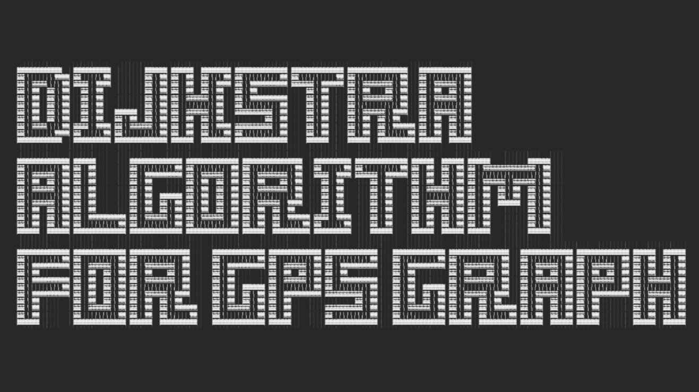
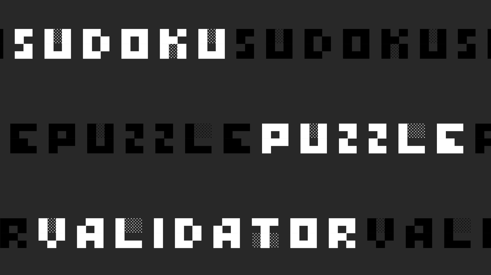
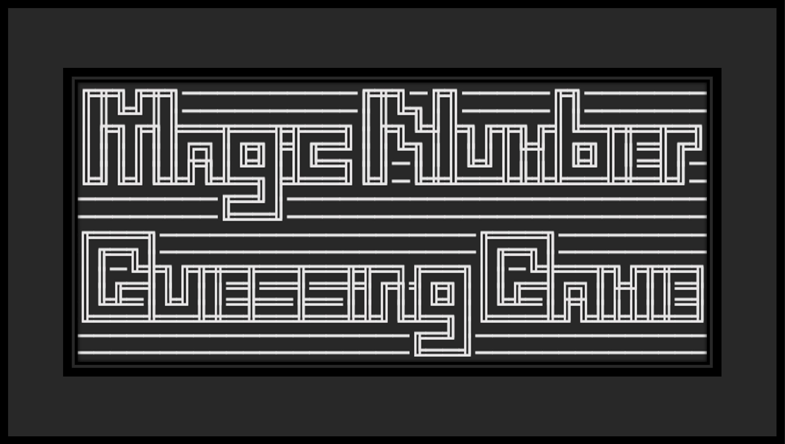
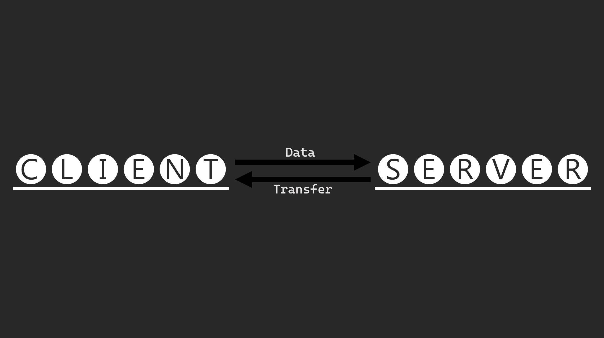

# Portfolio

<link rel="icon" type="image/x-con" href="/favicon.ico">

<h2 style="font-size: 40px font-weight: bold">Senior Portfolio</h2>

My Programming Projects
-----------------------

*For access to my private project repositories, please [email me](mailto:mdstargel@csustudent.net?subject=GitHub%20Access) with the subject line, GitHub Access.

---
### [Dijkstra Algorithm for GPS Graph | CSCI 415](project1)

---
### [Sudoku Puzzle Validator | CSCI 431](project2)

---
### [Minimum Overlap Coverage | CSCI 315](project3)

---
### [Magic Number Guessing Game | CSCI 301](project4)

---
### [Client Server Data Transfer | CSCI 332](project5)

---

Ethics Papers
-------------

### [Privacy and Anonymity](/pdf/CSCI_415_Ethics_Paper.pdf)

-   **Class: Algorithms (CSCI 415)**  
-   **Grade: A**

### [Ethics in Computer Testing](/pdf/CSCI_315_Ethics_Paper.pdf)

-   **Class: Data Structure Analysis (CSCI 315)** 
-   **Grade: A**

### [Ethical Dilemmas in the Workplace](/pdf/CSCI_325_Ethics_Paper.pdf)

-   **Class: Object-Oriented Programming (CSCI 325)** 
-   **Grade: A**

---

Presentations
-------------

### [Global Hotspot Brief - Israel](/pdf/Stargel_Global_Hotspot_Brief.pdf)

- **Class: National Security & Leadership Responsibilities I (AERO 401)** 
- **Grade: A**

### [Security Presentation](/pdf/Security_Presentation.pdf)

- **Class: Survey of Scripting Languages (CSCI 301)** 
- **Grade: A**
- Click [here](https://youtu.be/fo6R2U7Mz9E) for the presentation video.

---

Page template forked from <a href="https://github.com/csu-cs/csci-portfolio">CSU-CS</a>

<!-- Remove above link if you don't want to attributive -->
