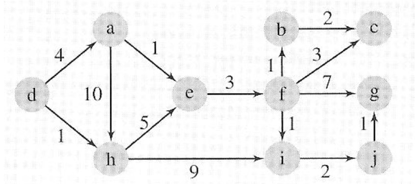
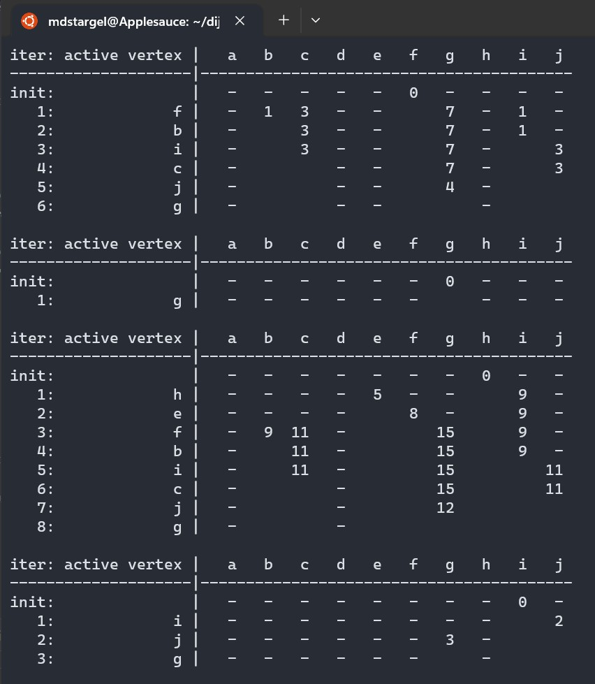

# Dijkstra Algorithm

[Back to Portfolio](./)

<h2 style="font-size: 30px">Dijkstra Algorithm for GPS Graph</h2>

-   **Class: Algorithms (CSCI 415)** 
-   **Grade: A** 
-   **Language(s): C++** 
-   **Source Code Repository:** [mdstargel/dijkstra-algorithm-project](https://github.com/mdstargel/dijkstra-algorithm-project)  
    (Please [email me](mailto:mdstargel@csustudent.net?subject=GitHub%20Access%20-%20Dijkstra%20Project) to request access.)

## Project Description

- This is a Dijkstra Algorithm program to solve a GPS problem. It reads inputs from a text file and finds the distance from a start vertex to the rest of the vertecies in a one-way adjacency matrix. The value of an entry represents the distance between two vertices. The format of the text file will be: Vertex, Vertex, Distance. Then it outputs the adjecency matrix and charts of the minimum distances using the Dijkstra Algorithm from a start vertex to the rest in the matrix as charts on the console.

## How to compile and run the program

Compile & Run:
```bash
g++ -Wextra project2.cpp -o p2 && ./p2
```

If the programming language does not require compilation, the update the heading to be “How to run the program.” If your application is deployed on a remote service, including instructions on how to deploy it.

## UI Design

1. Output the adjacency matrix.
2. Output all the charts from each starting vertex.  
\
  
_Fig 1. Example Matrix._  
\
  
_Fig 2. Example output after input is processed._  
\
  
_Fig 3. Output Matrix and Charts (a to b)._  
\
  
_Fig 4. Output Charts (c to e)._  
\
  
_Fig 5. Output Charts (f to i)._  
\
  
_Fig 6. Output Chart (j)._  
\
  
_Fig 7. Expected Chart example (vertex d) explained in realtion to output chart example._  
\
  
_Fig 8. Output Chart example (vertex d) explained in relation to example expected chart._  

## Additional Considerations

- The pdf intructions say to only output the one chart, my code outputs all of the charts from all the start vertecies.
- Future implementation: after outputting the matrix, ask the user where to start then only output one chart from that starting vertex.
- Where the directions have an infinity symbol and says to output '-1' I output a '-'


[Back to Portfolio](./)
