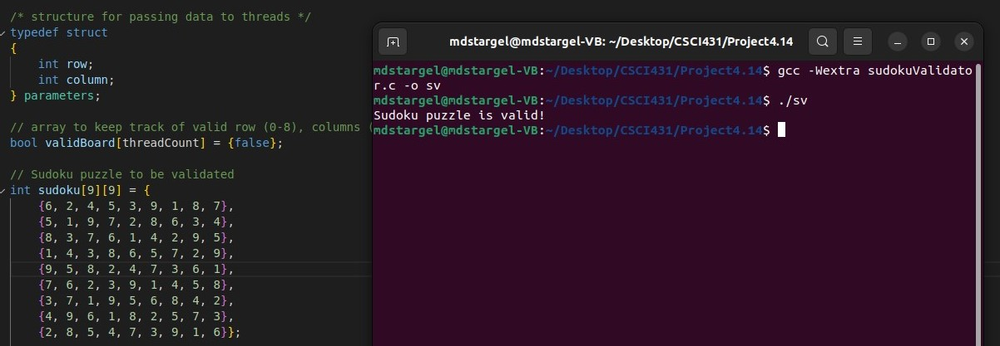
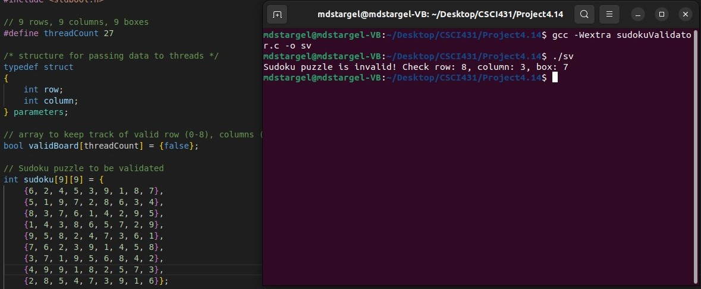

# Sudoku

[Back to Portfolio](./)

<h2 style="font-size: 30px">Sudoku Puzzle Validator</h2>

-   **Class: Operating Systems (CSCI 431)** 
-   **Grade: A** 
-   **Language(s): C** 
-   **Source Code Repository:** [mdstargel/soduku-puzzle-validator](https://github.com/mdstargel/soduku-puzzle-validator)  
    (Please [email me](mailto:mdstargel@csustudent.net?subject=GitHub%20Access%20-%20Sudoku%20Project) to request access.)
    
## Project description

This program reads in a sudoku board from the source code and checks it's validity using multithreading on the rows, columns, and boxes. 

## How to compile and run the program

How to compile (if applicable) and run the project.

```bash
gcc -Wextra sudokuValidator.c -o sv && ./sv
```

## UI Design

1. Divide the Sudoku grid into nine 3x3 subgrids, each containing nine cells.
2. Create a thread pool with nine threads, one for each subgrid.
3. For each subgrid, create a new thread that will validate it.
4. Each subgrid validation thread will check if the subgrid contains all numbers from 1 to 9 without repetition. It will also notify a shared boolean variable if it finds any duplicate numbers in the subgrid.
5. After all subgrid threads have finished executing, check the shared boolean variable. If it's false, the Sudoku puzzle is valid. If it's true, the puzzle is invalid.
6. Output "Sudoku puzzle is valid!" or "Sudoku puzzle is invalid! Check row: #, column: #, box: #"

  
Fig 1. Valid Puzzle.

  
Fig 2. Invalid Puzzle.

[Back to Portfolio](./)
