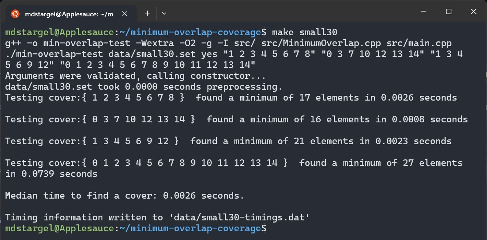
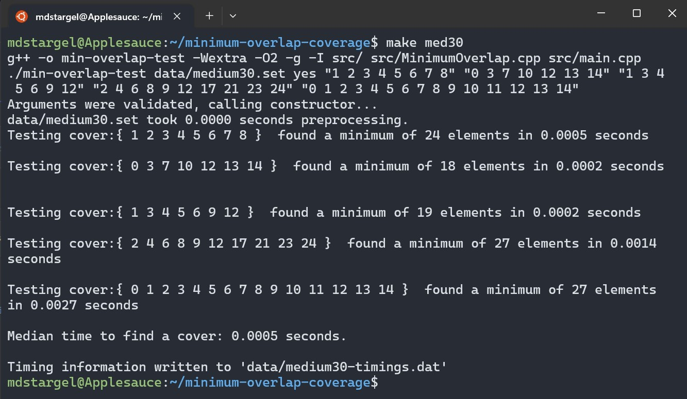
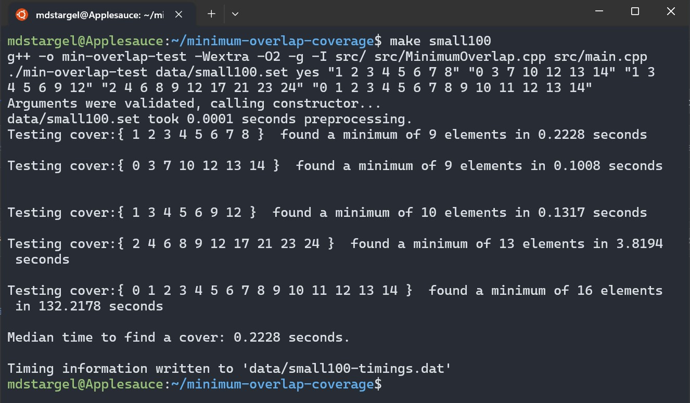

[Back to Portfolio](./)

Minimum Overlap Coverage
========================

-   **Class: Data Structure Analysis (CSCI 315)** 
-   **Grade: A+ (over 100%)** 
-   **Language(s): C++** 
-   **Source Code Repository:** [mdstargel/minimum-overlap-coverage](https://github.com/mdstargel/minimum-overlap-coverage)  
    (Please [email me](mailto:mdstargel@csustudent.net?subject=GitHub%20Access%20-%20Overlap%20Project) to request access.)

## Project description

- This project implementation will find the Minimum Overlap of sets that cover all points. For
example, suppose we have multiple group projects for our class that needed to be presented at the
end of the semester. Your professor must grade every student at least once, but wants to minimize
the number grades that must be performed. Your professor does not mind grading multiple projects.
- Students are members of multiple projects, but only want to present once. How can we minimize
the number of times a student has to present? Everyone in a group has to present (no partial group
presentations) and a grade must be assigned for each group member.
- To recap, here are the requirements in a list:
  - Each student is issued an ID number starting at 0. We do not care about their names.
  - Each group consisted of a set of numbers. A group cannot have duplicate students.
  - A query consisted of a group of numbers. A student may be in there more than one (your professor misplaced a past grade.)
  - When a group presents, all students are graded.
  - Your function returns the minimum number of grades your professor has to assess.
  - If it is not possible, return **UINT_MAX** (or −1, they are the same.)

## How to compile and run the program

```bash
make [name of data set]
```

Examples: 
```bash
make small30
```
```bash
make large50
```

## UI Design

Algorithm Setup
- **SOFAR** represents the sets you have chosen.
- **INPUT** represents the student/IDs that still need to be chosen.
- **print** is for printing debug information when **true**.
- **min** represents the minimum number of overlap found so far in a cover.
- **RESULT** is what is leftover from removing the evaluating set.

  
_Fig 1. Desired Output._  
\
  
_Fig 2. Output for small30._  
\
  
_Fig 3. Output for med30._  
\
  
_Fig 4. Output for large30._  
\
  
_Fig 5. Output for large50._  
\
  
_Fig 6. Output for small100._  

## Additional Considerations

Files
- **data/\* :** groups of sets that represent the groups that may be present.
- **src/main.cpp :** a general-purpose test program for running test cases on your code. It also
produces timings.
- **src/MinimumOverlap.hpp :** the class declaration that computes the minimum overlap.
- **src/MinimumOverlap.cpp :** the source file for the class that computes the minimum
overlap.
- **data/simple.set :** the example data set provided below.
- **data/small30.set :** small data set for evaluating basic timings.
- **data/medium30.set :** the data set you should strive to master.
- **data/large30.set :** a larger data set over **medium30.set**
- **data/large50.set :** the largest data set I will test.

[Back to Portfolio](./)
