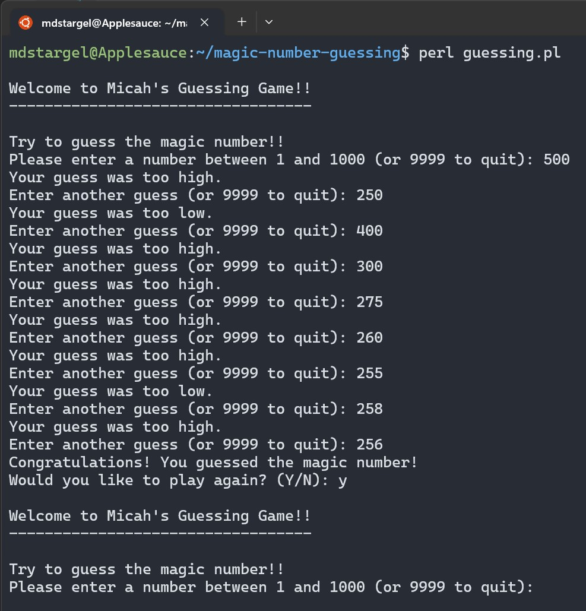
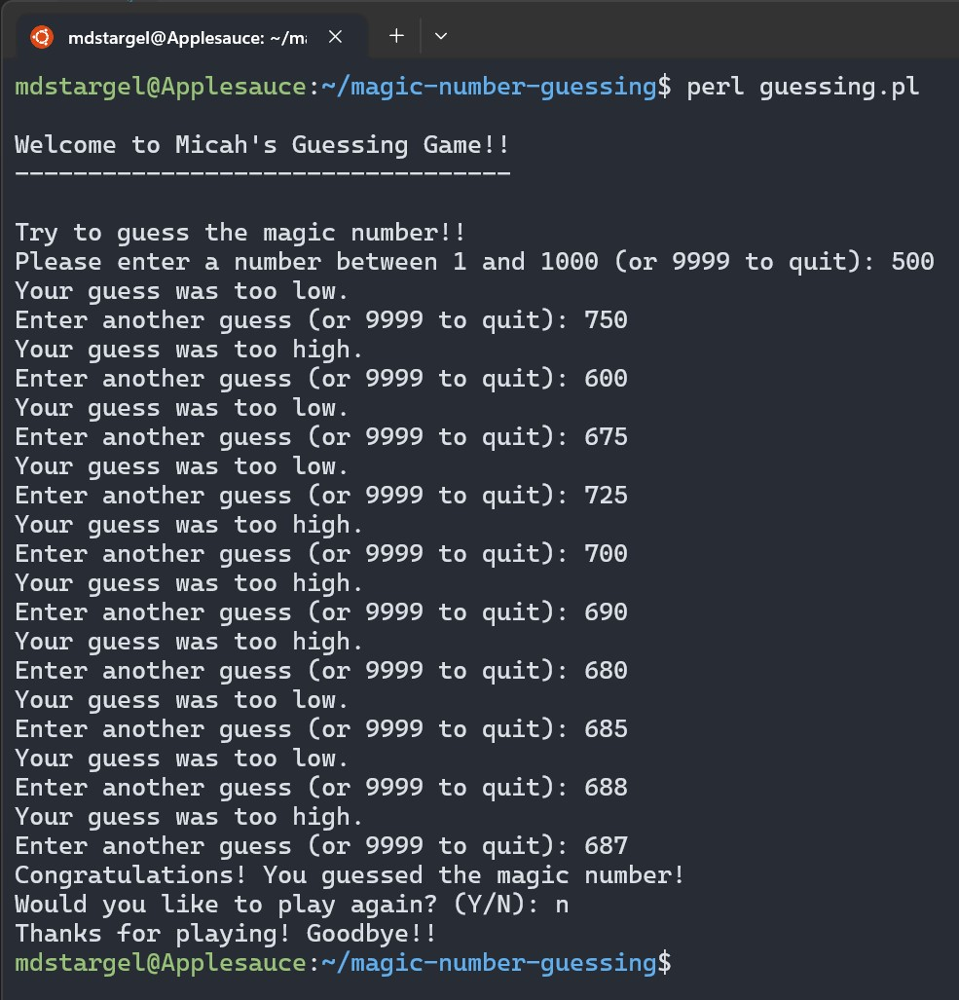
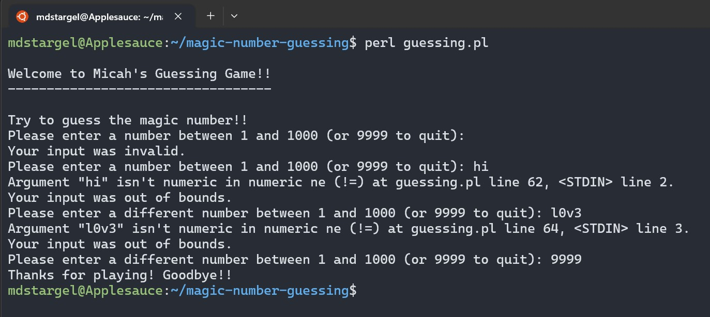

[Back to Portfolio](./)

Magic Number Guessing Game
===========================

-   **Class: Survey of Scripting Languages (CSCI 301)** 
-   **Grade: A** 
-   **Language(s): Perl** 
-   **Source Code Repository:** [mdstargel/magic-number-guessing](https://github.com/mdstargel/magic-number-guessing)  
    (Please [email me](mailto:mdstargel@csustudent.net?subject=GitHub%20Access%20-%20Guessing%20Game) to request access.)

## Project description

Plays a numerical guessing game.

- Print a welcoming message for the user.
- Ask the user to type in a numerical guess for the magic number.
- Tell the user if the guess is too high, too low, or just right.
- Quit with a closing message if the user guesses the magic number or types the quitting signal.

## How to compile and run the program

How to run the project via Terminal:

```bash
perl guessing.pl
```

## UI Design

1. Have the computer randomly assign a number to a variable
2. Receive user input and have the computer say whether it’s higher or lower than the variable.
3. If the number is the same as the variable, congratulate user and end game
4. Give user option to quit with escape "character" (9999) each time or enter numbers to keep guessing.

  
_Fig 1. A successful game then play again._
  
  
_Fig 2. A successful game then do not play again._
  
  
_Fig 3. Errors and Escape Character._
  
## 3. Additional Considerations

- Display useful error messages.
- Give user option to exit at anytime.
- Accept capital and lowercase ("Y/N" or "y/n").


[Back to Portfolio](./)
